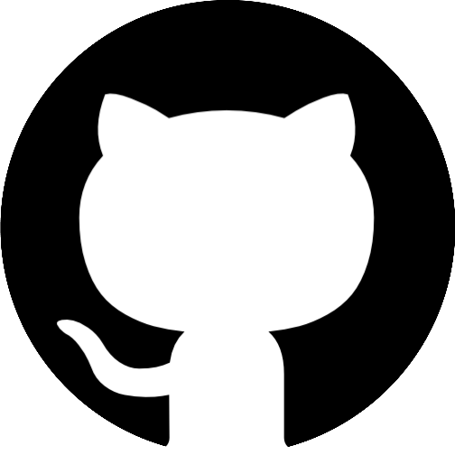

## Table of Contents

- [About](#about)
- [Demo](#demo)
- [Setup](#setup)
- [File Structure](#file-structure)
- [Contributing](#contibuting)
- [Progress](#progress)
- [Meet the Team](#meet-the-team)
- [License](#license)

<p align="center">
  
</p>

## ABOUT

**Kubby Buddy** is your container manegment buddy, giving you an easy to use GUI for all your Docker needs. All you need to do is launch our application, and your local images will load into our app, from there you can easily view, launch, stop and even delete your containers and images straight from our app. We also include metrics and even averages of your CPU and memory usgage utilizing a containerized database running on your local machine.

<div align="center">
  
  
  
  
  
  
  
  
  
  
  
  
  
  
  
</div>

## Demo

Here we can see creating a container from an image.


Here we can see our running containers, starting and stopping those containers as well as the logs for those containers.


Here we create a new volume, then delete it.


## SETUP

Follow these steps for easy setup.

1. Fork and clone this repository.

```bash
git clone https://github.com/<your-github-username>/kubby-buddy.git
```

2. Navigate to the directory of the cloned repository.

```bash
cd kubby-buddy
```

3. Install the npm packages.

```bash
npm install
```

4. Start kubby buddy in your terminal.

```bash
npm start
```

5. In your browser open 'http://localhost:8080/'.

And you're done, enjoy the simplicity of using your new container management buddy.

## File Structure

```
.
├── LICENSE
├── README.md
├── __mocks__
│   ├── dockerode.ts
│   ├── fileMock.ts
│   ├── node-fetch.ts
│   └── urlMock.ts
├── __tests__
│   ├── controllers
│   └── routes
├── babel.config.js
├── cypress
│   ├── e2e
│   ├── fixtures
│   ├── integration
│   └── support
├── cypress.config.ts
├── docker-compose.yml
├── jest.config.ts
├── package-lock.json
├── package.json
├── server
│   ├── controllers
│   ├── db.ts
│   ├── models
│   ├── routes
│   ├── server.ts
│   └── util.ts
├── src
│   ├── App.scss
│   ├── App.tsx
│   ├── UserContext.tsx
│   ├── assets
│   ├── components
│   ├── global.d.ts
│   ├── index.html
│   ├── index.tsx
│   └── types.ts
├── tsconfig.json
├── types.ts
└── webpack.config.cjs
```

## Contibuting

Contributing is what makes the open source community great. If you want to contribute to this project, you can follow these guidelines.

- Fork and clone the repository.
- Branch off the dev branch, with a branch name starting in feat, fix, bug, docs, test, wip or merge, then adding a new folder named whatever it is you are adding. (ex. feat/database)
- When you commit, be sure to follow [conventional commit](https://www.conventionalcommits.org/en/v1.0.0/) standards.
- Once your new feture is built out, you can submit a pull request to dev.

## Progress

| Feature                                                | Status                                                |
| ------------------------------------------------------ | ----------------------------------------------------- |
| Image page                                             |   |
| Container page                                         |   |
| Volume page                                            |   |
| Fix containerized database                             |   |
| Impliment Grafana                                      |   |
| Bring extention to feature parody                      |   |
| Add alerts for when buttons fail to load               |  |
| Fix container not loading when started outside the app |  |
| Add more diverse and costomizable commands             |  |

-  = Finished feature
-  = Work in progress feature
-  = Not yet started feature

## Meet the Team!

<table align="center">
  <tr>
    <td align="center">
      
      <br />
      <sub><b>Chang Moon</b></sub>
      <br />
      <a href="https://www.linkedin.com/in/kasualkid12/"></a>
      <a href="https://www.linkedin.com/in/kasualkid12/"></a>
    </td>
    <td align="center">
      
      <br />
      <sub><b>Josh Goo</b></sub>
      <br />
      <a href="https://www.linkedin.com/in/kasualkid12/"></a>
      <a href="https://www.linkedin.com/in/kasualkid12/"></a>
    </td>
    <td align="center">
      
      <br />
      <sub><b>Steve Lemlek</b></sub>
      <br />
      <a href="https://www.linkedin.com/in/kasualkid12/"></a>
      <a href="https://www.linkedin.com/in/kasualkid12/"></a>
    </td>
    <td align="center">
      
      <br />
      <sub><b>Trey Walker</b></sub>
      <br />
      <a href="https://www.linkedin.com/in/kasualkid12/"></a>
      <a href="https://www.linkedin.com/in/kasualkid12/"></a>
    </td>
    <td align="center">
      
      <br />
      <sub><b>William Reilly</b></sub>
      <br />
      <a href="https://www.linkedin.com/in/kasualkid12/"></a>
      <a href="https://www.linkedin.com/in/kasualkid12/"></a>
    </td>
  </tr>
</table>

## License

This project is licensed under the terms of the [MIT LICENSE](./LICENSE).

# Kubby Buddy - Docker Extension

This repository defines an example of a Docker extension. The files in this repository have been automatically generated as a result of running `docker extension init`.

This extension is composed of:

- A [frontend](./ui) app in React that makes a request to the `/hello` endpoint and displays the payload in Docker Desktop.
- A [backend](./backend) container that runs an API in Go. It exposes the `/hello` endpoint which returns a JSON payload.

> You can build your Docker Extension using your fav tech stack:
>
> - Frontend: React, Angular, Vue, Svelte, etc.
>   Basically, any frontend framework you can bundle in an `index.html` file with CSS, and JS assets.
> - Backend (optional): anything that can run in a container.

<details>
  <summary>Looking for more templates?</summary>

1. [React + NodeJS](https://github.com/benja-M-1/node-backend-extension).
2. [React + .NET 6 WebAPI](https://github.com/felipecruz91/dotnet-api-docker-extension).

Request one or submit yours [here](https://github.com/docker/extensions-sdk/issues).

</details>

## Local development

You can use `docker` to build, install and push your extension. Also, we provide an opinionated [Makefile](Makefile) that could be convenient for you. There isn't a strong preference of using one over the other, so just use the one you're most comfortable with.

To build the extension, use `make build-extension` **or**:

```shell
  docker buildx build -t coachsteve/extension-2:latest . --load
```

To install the extension, use `make install-extension` **or**:

```shell
  docker extension install coachsteve/extension-2:latest
```

> If you want to automate this command, use the `-f` or `--force` flag to accept the warning message.

To preview the extension in Docker Desktop, open Docker Dashboard once the installation is complete. The left-hand menu displays a new tab with the name of your extension. You can also use `docker extension ls` to see that the extension has been installed successfully.

### Frontend development

During the development of the frontend part, it's helpful to use hot reloading to test your changes without rebuilding your entire extension. To do this, you can configure Docker Desktop to load your UI from a development server.
Assuming your app runs on the default port, start your UI app and then run:

```shell
  cd ui
  npm install
  npm run dev
```

This starts a development server that listens on port `3000`.

You can now tell Docker Desktop to use this as the frontend source. In another terminal run:

```shell
  docker extension dev ui-source coachsteve/extension-2:latest http://localhost:3000
```

In order to open the Chrome Dev Tools for your extension when you click on the extension tab, run:

```shell
  docker extension dev debug coachsteve/extension-2:latest
```

Each subsequent click on the extension tab will also open Chrome Dev Tools. To stop this behaviour, run:

```shell
  docker extension dev reset coachsteve/extension-2:latest
```

### Backend development (optional)

This example defines an API in Go that is deployed as a backend container when the extension is installed. This backend could be implemented in any language, as it runs inside a container. The extension frameworks provides connectivity from the extension UI to a socket that the backend has to connect to on the server side.

Note that an extension doesn't necessarily need a backend container, but in this example we include one for teaching purposes.

Whenever you make changes in the [backend](./backend) source code, you will need to compile them and re-deploy a new version of your backend container.
Use the `docker extension update` command to remove and re-install the extension automatically:

```shell
docker extension update coachsteve/extension-2:latest
```

> If you want to automate this command, use the `-f` or `--force` flag to accept the warning message.

> Extension containers are hidden from the Docker Dashboard by default. You can change this in Settings > Extensions > Show Docker Extensions system containers.

### Clean up

To remove the extension:

```shell
docker extension rm coachsteve/extension-2:latest
```

## What's next?

- To learn more about how to build your extension refer to the Extension SDK docs at https://docs.docker.com/desktop/extensions-sdk/.
- To publish your extension in the Marketplace visit https://www.docker.com/products/extensions/submissions/.
- To report issues and feedback visit https://github.com/docker/extensions-sdk/issues.
- To look for other ideas of new extensions, or propose new ideas of extensions you would like to see, visit https://github.com/docker/extension-ideas/discussions.
